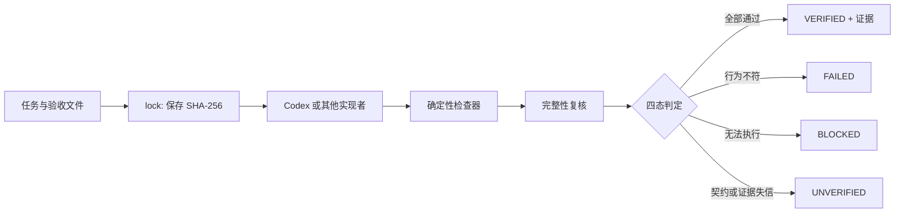

# 架构与安全边界

## 判定链路

核心模块保持模型无关：`shipproof.yml`、校验器、哈希和证据报告不依赖任何大模型。Codex Hook、SDK 与 GitHub Action 只是适配器。

## 为什么是四态

二元成功/失败会把两类不同问题混在一起：产品确实不符合要求，以及环境使我们无法知道结果。ShipProof 将它们区分：

- `FAILED` 表示已获得反证，例如测试失败或页面缺少目标元素。
- `BLOCKED` 表示没有足够运行条件，例如服务未启动、命令超时或浏览器缺失。
- `UNVERIFIED` 表示证据链不可信，例如锁缺失、测试文件被改弱、任务定义变化或代码在证据生成后改变。

只有必需检查均为 `PASSED` 且完整性成立时才返回 `VERIFIED`。可选检查失败会记录，但不会改变最终结论。

## 威胁模型

ShipProof v0.1 主要防范以下常见误判：

1. 代理用文字声称已完成，却没有运行验收。
2. 代理修改或删除测试，使实现更容易通过。
3. 把旧的本地服务、Mock 或静态页面当成当前实现。
4. 用旧报告证明已经变化的工作区。
5. 命令因依赖、超时或环境问题没有真正运行，却被表述为成功。

它不防范拥有同等文件和 CI 管理权限的恶意管理员，也不判断验收条件是否覆盖了完整业务目标。若攻击者能同时改源码、可信基线、CI 配置和发布密钥，仓库内工具无法单独建立信任。

## 完整性机制

- `lock` 保存配置原文、受保护文件集合和可选任务文件的 SHA-256。
- `verify` 在检查前后各取一次完整性快照，防止检查过程修改验收契约。
- 报告记录 Git commit、dirty 状态和工作区指纹。
- `report` 重新计算指纹；任何工作区变化都会将旧结论降为 `UNVERIFIED`。
- GitHub Action 可从 `baseline-ref` 读取受保护文件，避免只信任 PR 工作树中的验收定义。

## 服务与浏览器证据

当检查配置了 `start` 时，ShipProof 会先探测目标 URL。若 URL 已经响应且 `allowExisting` 不是 `true`，它返回 `BLOCKED`，而不是复用未知进程。新服务由独立进程组启动，验证结束后终止；启动日志进入证据。

Playwright URL 模式使用真实 Chromium、指定视口和页面导航，不把 HTTP 200 等同于 UI 验收。它至少可以检查正文、选择器、标题并保存全页截图。复杂交互可使用 `script` 模式执行项目自己的 Playwright 用例。

## 证据与隐私

命令 stdout/stderr 最多各保留 256 KiB，HTTP 正文最多保留 32 KiB。运行时会收集常见名称中含 `TOKEN`、`SECRET`、`PASSWORD`、`API_KEY` 等环境变量的值并替换为 `[REDACTED]`。这只是纵深防御：团队仍不应让测试打印密钥、个人数据或生产数据。

## 已知限制

- v0.1 的锁保存在工作区，不是密码学签名；高信任场景应由受保护 CI 分支或外部签名服务生成。
- 浏览器 URL 模式验证通用断言，不理解特定业务语义。
- Git 的 submodule、LFS 和生成型大型仓库还没有专门优化。
- Windows 进程树终止策略仍需更多实机验证。
- 没有远程证据存储、组织策略和可视化控制台。
